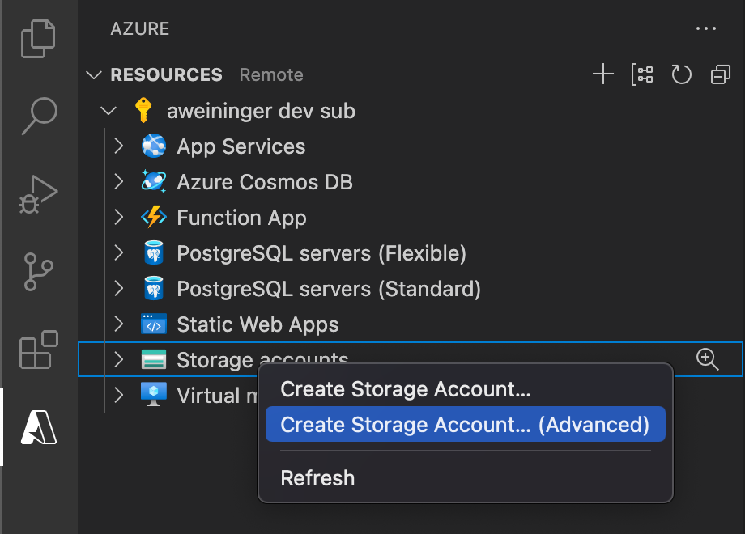
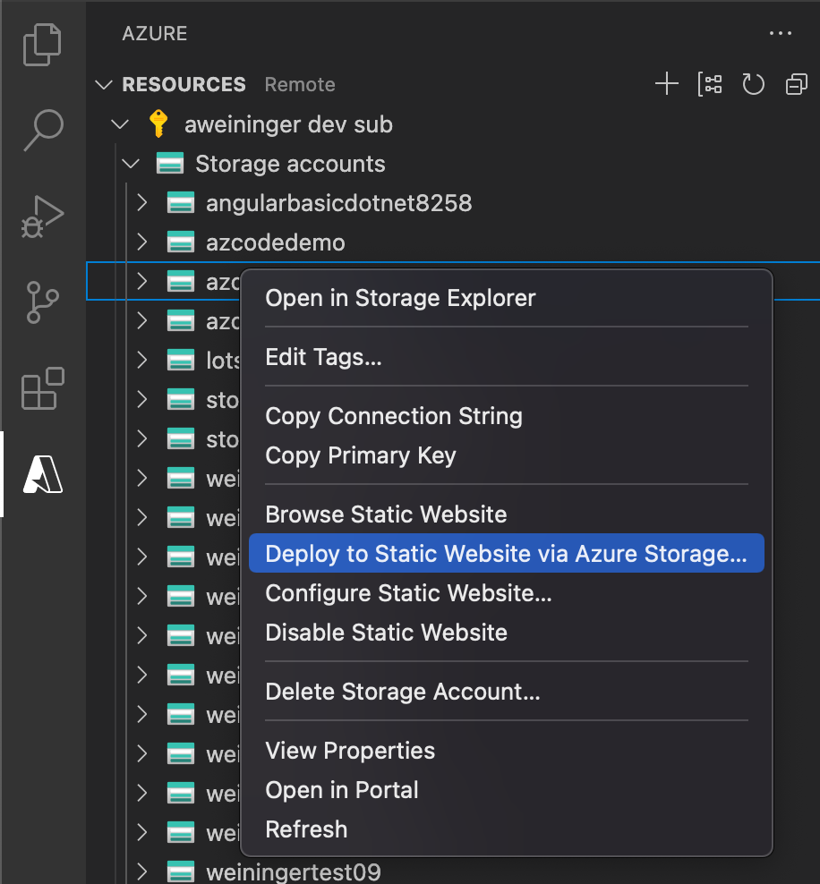

# Azure Storage for Visual Studio Code (Preview)

<!-- region exclude-from-marketplace -->

  

<!-- endregion exclude-from-marketplace -->

Azure Storage is a Microsoft-managed service providing cloud storage that is highly available, secure, durable, scalable, and redundant. Use the extension to deploy static websites and Single Page Apps (SPAs) and browse Azure Blob Containers, File Shares, Tables, and Queues.

**Visit the [wiki](https://github.com/Microsoft/vscode-azurestorage/wiki) for additional information about the extension.**

> Sign up today for your free Azure account and receive 12 months of free popular services, $200 free credit and 25+ always free services 👉 [Start Free](https://azure.microsoft.com/free/open-source).

## Features

* Explore/Create/Delete Blob Containers, File Shares, Queues, Tables and Storage Accounts
* Create, Edit, and Delete Block Blobs and Files
* Upload and Download Blobs, Files, and Folders
* Access Connection String and Primary Key
* Open in Storage Explorer for memory or computationally heavy tasks, or for Page and Append Blob support.

## Installation

1. Download and install the [Azure Storage extension](https://marketplace.visualstudio.com/items?itemName=ms-azuretools.vscode-azurestorage) for Visual Studio Code
2. Once complete, you'll see an Azure icon in the Activity Bar
    > If your activity bar is hidden, you won't be able to access the extension. Show the Activity Bar by clicking View > Appearance > Show Activity Bar
3. Sign in to your Azure Account by clicking Sign in to Azure...
    >  If you don't already have an Azure Account, click "Create a Free Azure Account" for a free 30-day account with $200 in Azure credits to try out any combination of services.

## Deploy your Single Page App to Azure Storage

Once you are signed in to your Azure account and you have your app open in Visual Studio Code, right click the Storage accounts item and select "Create Storage Account... (Advanced)"

1. Type a globally unique name for your Storage Account and press Enter. Valid characters for an storage account name are 'a-z' and '0-9'
2. Create a new Resource Group and accept the default name
3. Choose a location in a [region](https://azure.microsoft.com/en-us/global-infrastructure/regions/) near you or near other services you may need to access
    > It may take up to a minute for the account to be created
4. When prompted, choose "Enable website hosting" to configure your storage account for static site hosting
5. Enter 'index.html' for the index document path
6. Enter 'index.html' for the 404 error document path
    > Index.html is used for the error document because modern Single Page Applications (SPAs) such as React will handle errors in the client. For classic static websites, use the error document to customize your 404 page.

Once you have created your Storage Account, right click on the Storage Account and select "Deploy to Static Website via Azure Storage...".

> Tip: Looking for a sample app to deploy? Run `npx create-react-app my-react-app` to create one

Make sure you've compiled your app (run `npm run build` if you created a sample from create-react-app) prior to deploying it to Azure.

Select the build output from your current workspace if you have your app open already or browse to the directory containing your compiled application code
    > If you have a `build`, `out`, or `dist` directory, you'll see it as an option to deploy from.

Once the deployment completes, click **Browse to Website** in the prompt to view your freshly deployed website.

## Settings

Use these configuration settings to customize the Azure Storage extension.

* `azureStorage.showExplorer`: Set to `false` to hide Azure Storage Explorer
* `azureStorage.preDeployTask`: Set to the name of a task to be run before deploying a static website.
* `azureStorage.storageExplorerLocation`:  [Mac only] Set to `"Path/To/Microsoft Azure Storage Explorer.app"` to override the default location.
* `azureStorage.file.showSavePrompt`: Set to `false` to prevent showing a warning dialog on File file save.
* `azureStorage.blob.showSavePrompt`: Set to `false` to prevent showing a warning dialog on Blob file save.

<!-- region exclude-from-marketplace -->

## Contributing

There are several ways you can contribute to our [repo](https://github.com/Microsoft/vscode-azurestorage):

* **Ideas, feature requests and bugs**: We are open to all ideas and we want to get rid of bugs! Use the [Issues](https://github.com/Microsoft/vscode-azurestorage/issues) section to report a new issue, provide your ideas or contribute to existing threads.
* **Documentation**: Found a typo or strangely worded sentences? Submit a PR!
* **Code**: Contribute bug fixes, features or design changes:
  * Clone the repository locally and open in VS Code.
  * Run "Extensions: Show Recommended Extensions" from the [command palette](https://code.visualstudio.com/docs/getstarted/userinterface#_command-palette) and install all extensions listed under "Workspace Recommendations"
  * Open the terminal (press <kbd>CTRL</kbd>+ <kbd>\`</kbd>) and run `npm install`.
  * To build, press <kbd>F1</kbd> and type in `Tasks: Run Build Task`.
  * Debug: press <kbd>F5</kbd> to start debugging the extension.

## Legal

Before we can accept your pull request you will need to sign a **Contribution License Agreement**. All you need to do is to submit a pull request, then the PR will get appropriately labelled (e.g. `cla-required`, `cla-norequired`, `cla-signed`, `cla-already-signed`). If you already signed the agreement we will continue with reviewing the PR, otherwise system will tell you how you can sign the CLA. Once you sign the CLA all future PR's will be labeled as `cla-signed`.

## Code of Conduct

This project has adopted the [Microsoft Open Source Code of Conduct](https://opensource.microsoft.com/codeofconduct/). For more information see the [Code of Conduct FAQ](https://opensource.microsoft.com/codeofconduct/faq/) or contact [opencode@microsoft.com](mailto:opencode@microsoft.com) with any additional questions or comments.

<!-- endregion exclude-from-marketplace -->

## Telemetry

VS Code collects usage data and sends it to Microsoft to help improve our products and services. Read our [privacy statement](https://go.microsoft.com/fwlink/?LinkID=528096&clcid=0x409) to learn more. If you don't wish to send usage data to Microsoft you can set the `telemetry.enableTelemetry` setting to `false`. Learn more in our [FAQ](https://code.visualstudio.com/docs/supporting/faq#_how-to-disable-telemetry-reporting).

## License

[MIT](LICENSE.md)
