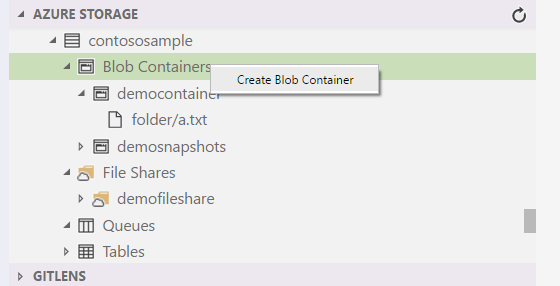
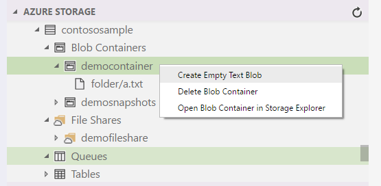
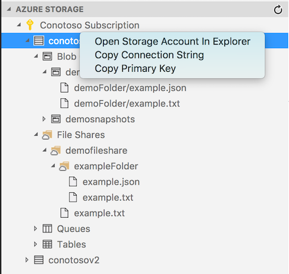
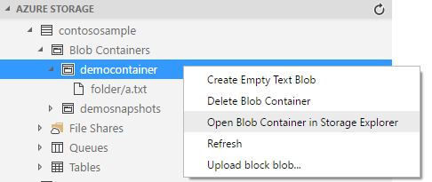
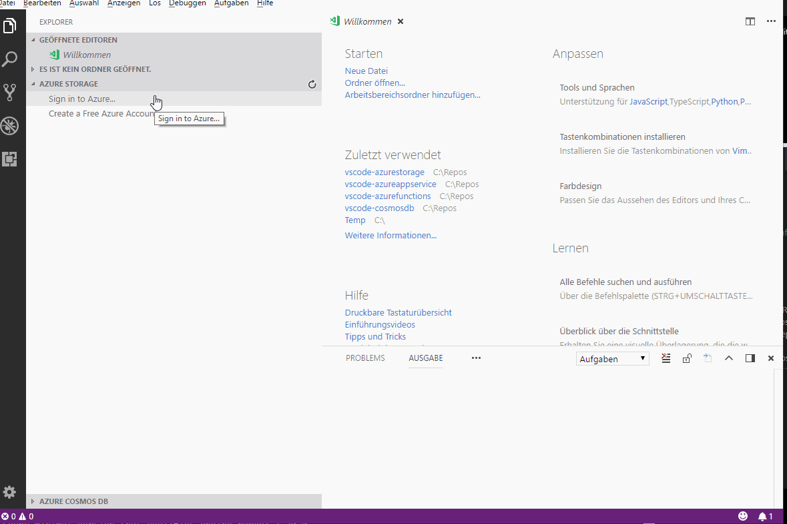
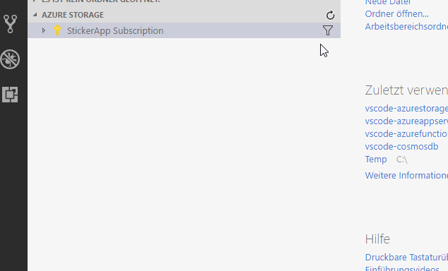

# Azure Storage for Visual Studio Code (Preview)

The Azure Storage extension for VS Code lets you deploy static websites and browse Azure Blob Containers, File Shares, Tables, and Queues. Follow [this tutorial](https://code.visualstudio.com/tutorials/static-website/getting-started) to deploy your web apps to Azure Storage from VS Code.

## Features

* Explore/Create/Delete Blob Containers, File Shares, Queues and Tables

  

* Create, Edit, and Delete Block Blobs and Files

* Upload and Download Blobs up to 4MB in size

   

* Access Connection String and Primary Key

   

* Open in Storage Explorer for memory or computationally heavy tasks, or for upload/download of large or non-text files.

   

## Extension Settings

* `azureStorage.showExplorer`: Set to `false` to hide Azure Storage Explorer
* `azureStorage.storageExplorerLocation`:  [Mac only] Set to `"Path/To/Microsoft Azure Storage Explorer.app"` to override the default location.
* `azureStorage.file.showSavePrompt`: Set to `false` to prevent showing a warning dialog on File file save.
* `azureStorage.blob.showSavePrompt`: Set to `false` to prevent showing a warning dialog on Blob file save.

## Preview Features

* Deploy to static website
  * To enable this feature, click File (Code for Mac) > Preferences > Settings (`CTRL+,` or `CMD+,`) and add the setting `azureStorage.preview.staticWebsites` set to true.
    Static websites are an Azure preview feature that is only supported in some regions (e.g. West Central US), and only for GPv2 storage accounts.

  * When configuring your storage account for static site hosting, you **must** set the *index document name*.

  * Known issue: If "Configure Static Websites..." displays a blank web page on the Azure portal, the storage account does not support static web pages.
    Create a new storage account in West Central US with account kind set to "StorageV2" and try again.

## Managing Azure Subscriptions

If you are not signed in to Azure, you will see a "Sign in to Azure..." link. Alternatively, you can select "View->Command Palette" in the VS Code menu, and search for "Azure: Sign In".

If you don't have an Azure Account, you can sign up for one today for free and receive $200 in credits by selecting "Create a Free Azure Account..." or selecting "View->Command Palette" and searching for "Azure: Create an Account".

You may sign out of Azure by selecting "View->Command Palette" and searching for "Azure: Sign Out".

To select which subscriptions show up in the extension's explorer, click on the "Select Subscriptions..." button on any subscription node (indicated by a "filter" icon when you hover over it), or select "View->Command Palette" and search for "Azure: Select Subscriptions". Note that this selection affects all VS Code extensions that support the [Azure Account and Sign-In](https://github.com/Microsoft/vscode-azure-account) extension.

## Known Issues

This extension focuses on simple developer and editing scenarios that are convenient from within VS Code.  Therefore, the following scenarios are not supported:

* Classic Azure Storage Accounts not supported.
* Viewing diagnostics and logs tables is not supported.
* Viewing the contents of tables and queues is not supported.
* Uploading or downloading binary files (except images) is not supported.
* Uploading or downloading of blobs is limited to text file types, block blobs and up to 4MB in size. Uploading and downloading of files in file shares is not currently supported.

For these scenarios and other advanced features, please use [Microsoft Azure Storage Explorer](https://storageexplorer.com), which is free and available cross-platform for Linux, MacOS and Windows.
Feedback on supported or desired features, as well as issues that you find, is always encouraged. Simply enter an [issue](https://github.com/Microsoft/vscode-azurestorage/issues).

## Contributing

There are several ways you can contribute to our [repo](https://github.com/Microsoft/vscode-azurestorage):

* **Ideas, feature requests and bugs**: We are open to all ideas and we want to get rid of bugs! Use the [Issues](https://github.com/Microsoft/vscode-azurestorage/issues) section to report a new issue, provide your ideas or contribute to existing threads.
* **Documentation**: Found a typo or strangely worded sentences? Submit a PR!
* **Code**: Contribute bug fixes, features or design changes:
  * Clone the repository locally and open in VS Code.
  * Open the terminal (press `CTRL+`\`) and run `npm install`.
  * To build, press `F1` and type in `Tasks: Run Build Task`.
  * Debug: press `F5` to start debugging the extension.

## Legal

Before we can accept your pull request you will need to sign a **Contribution License Agreement**. All you need to do is to submit a pull request, then the PR will get appropriately labelled (e.g. `cla-required`, `cla-norequired`, `cla-signed`, `cla-already-signed`). If you already signed the agreement we will continue with reviewing the PR, otherwise system will tell you how you can sign the CLA. Once you sign the CLA all future PR's will be labeled as `cla-signed`.

## Code of Conduct

This project has adopted the [Microsoft Open Source Code of Conduct](https://opensource.microsoft.com/codeofconduct/). For more information see the [Code of Conduct FAQ](https://opensource.microsoft.com/codeofconduct/faq/) or contact [opencode@microsoft.com](mailto:opencode@microsoft.com) with any additional questions or comments.

## Telemetry

VS Code collects usage data and sends it to Microsoft to help improve our products and services. Read our [privacy statement](https://go.microsoft.com/fwlink/?LinkID=528096&clcid=0x409) to learn more. If you don't wish to send usage data to Microsoft you can set the `telemetry.enableTelemetry` setting to `false`. Learn more in our [FAQ](https://code.visualstudio.com/docs/supporting/faq#_how-to-disable-telemetry-reporting).

## License

[MIT](LICENSE.md)
